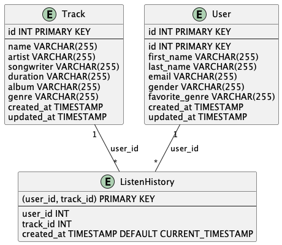

# Réponses du test

## _Utilisation de la solution (étape 1 à 3)_

## Prérequis
- Avoir un environnement de développement fonctionnel (python, pip, etc.)
- Avoir docker installé sur votre machine avec docker-compose
  - Airflow nécessite des configurations de base pour fonctionner correctement avec docker.
    - 4gb de mémoire allouée à docker
    - 2 cpu alloués à docker
    - 10gb de disque alloué à docker
    - Pour plus de détails, voir la documentation d'Airflow : https://airflow.apache.org/docs/apache-airflow/stable/howto/docker-compose/index.html#before-you-begin

Ce n'est pas nécessaire pour exécuter la solution étant donnée que j'utilise docker, mais si vous voulez pas avoir d'erreur en local, avoir de l'auto-complétion et pouvoir exécuter les tests, je recommande d'installer les dépendances du projet dans un environnement virtuel. Pour le faire, exécutez les commandes suivantes en vous placant à la racine du projet:

```pip install -r requirements.txt -r fastapi_app/requirements.txt -r airflow_project/requirements.txt```

## Détails de l'API

Pour avoir une meilleure séparation entre le flux de données et l'API, j'ai décidé de déplacer les fichiers reliés à l'API dans un répertoire séparé nommé `/fastapi`. J'ai aussi ajouté un fichier `Dockerfile` pour permettre de construire une image docker de l'API.

## Détails du flux des données avec AIRFLOW

Pour exécuter des flux de données, j'ai décidé d'utiliser Airflow. C'est un outil Open-Source qui est un standard dans l'industrie. Cette solution prend en compte l'évolution du projet. Airflow pourra être utilisé pour automatiser les tâches de calculs de recommandations et de réentraînement du modèle.

Une fois que la solution est déployée, le flux de données devrait être exécuté chaque jour à 9h. L'heure est un peu arbitraire pour l'instant et devrait être ajustée selon les besoins du projet. Il pourrait être aussi bon de considérer une heure où les ressources sont le moins utilisées, ce qui peut améliorer la performance du flux et aussi ne pas affecter la performance de l'API. Pour changer l'heure d'exécution, il suffit d'aller dans le fichier [suivant](../airflow_project/dags/music_reco/load_moovitamix_to_mysl.py).

Pour voir les flux de données, vous pouvez vous rendre sur le dashboard d'Airflow. Pour le déploiement en local, le dashboard est disponible à l'adresse suivante: http://localhost:8080/ . Pour se connecter, utiliser le nom d'utilisateur et le mot de passe spécifié dans le fichier `.env` (je le mentionne plus bas). Il est possible d'exécuter manuellement les flux de données à partir de ce dashboard.

## Déploiment de la solutions

Pour simplifier le déploiement de la solution, j'ai décidé d'utiliser `docker compose`. Ceci permet de tout déployer en une seule ligne de commande.

Pour des raisons de sécurité, je n'ai pas ajouté le fichiers `.env` dans le projet. Il est donc nécessaire de créer le fichier `.env` à la racine du projet et d'y ajouter les variables suivantes:

IMPORTANT: Les variables entre `{}` doivent être modifiées. Les variables de base dans les `{}` sont seulement à titre d'exemple et ne devrait pas être utilisé autre que poud du développement en local.

```
#----------------------------------
# Variable pour Airflow
#----------------------------------
# PostgreSQL (Airflow Metadata)
POSTGRES_USER= {à modifié, de base c'est airflow}
POSTGRES_PASSWORD= {à modifié, de base c'est airflow}
POSTGRES_DB= {à modifié, de base c'est airflow}

# Airflow Admin
AIRFLOW_ADMIN_USER={à modifié, de base c'est admin}
AIRFLOW_ADMIN_PASSWORD={à modifié, de base c'est admin}

# Airflow Project Directory
AIRFLOW_PROJ_DIR=./airflow_project


#----------------------------------
# Variable pourFastAPI
#----------------------------------
FASTAPI_URL=http://fastapi:8000

#----------------------------------
# Variable pour MySQL
#----------------------------------
MYSQL_ROOT_PASSWORD={à modifié, de base c'est root}
MYSQL_DATABASE={à modifié, de base c'est etl_db}
MYSQL_USER={à modifié, de base c'est etl_user}
MYSQL_PASSWORD={à modifié, de base c'est etl_password}

```

Une fois le fichier `.env` créer et remplis, vouz avec juste à vous placer à la racine du projet et exécuter la commande suivante:

```docker compose up```

## Exécutions des tests

Avant de pouvoir exécuté les tests, vous devez avoir installer les dépendance du projet. Pour ce faire, exécutez la commande suivante à la racine du projet:

```pip install -r requirements.txt -r fastapi_app/requirements.txt -r airflow_project/requirements.txt```

Après, vous devez aussi ajouté un fichier `.test.env` à la racine du projet. Ceci représente les valeurs d'environnement pour les tests. Voici les différentes variables qui doivent être présentes:

IMPORTANT: Encore une fois, vous devez modifier les variables entre `{}`. Si vous utilisé docker en local, juste faire attention que les valeur de MySQL et FastAPI concorde avec ceux de votre fichier `.env`.
```
#----------------------------------
# Variable pour les test de MySQL
#----------------------------------
MYSQL_ROOT_PASSWORD=root{à modifié, de base c'est root}
MYSQL_DATABASE={à modifié, de base c'est test_db}
MYSQL_USER={à modifié, de base c'est root}
MYSQL_PASSWORD={à modifié, de base c'est root}
MYSQL_HOST={à modifié, de base c'est localhost}

#----------------------------------
# Variable pour les test de l'API
#----------------------------------
FASTAPI_URL={si vous utilisé docker en locale, la valeur est supposé être http://0.0.0.0:8000 }
```


Pour l'exécution des tests, vous devez faire les étapes suivantes:
- Se placer dans la racine du projet
- en local ```docker compose up``` pour démarrer les services nécessaires. Pour les tests, vous pouvez aussi juste démarrer les services de MySLQ et de l'API fastAPI.
- Si ce n'est pas déjà fait, installer les dépendances du projet en exécutant la commande suivante:
  ```pip install -r requirements.txt -r fastapi_app/requirements.txt -r airflow_project/requirements.txt```
- Exécuter les tests en exécutant la commande suivante:
  ```pytest```

IMPORTANT: Si jamais vous avez des erreurs lors des tests, je recommande d'exécuter la commande suivante:
```unset MYSQL_USER FASTAPI_URL MYSQL_ROOT_PASSWORD MYSQL_DATABASE MYSQL_PASSWORD```. Je n'ai pas réussi à trouvé la source du problème, mais il arrive que les variables d'enviromment dans le fichier `.env` sont enregistré dans le système et peuvent causer des erreurs lors des tests. Je ne sais pas si c'est un problème sur mon ordinateur ou dans le code. J'ai cherché en ligne pour trouver une solution, mais je n'ai pas trouvé.

## Questions (étapes 4 à 7)

### Étape 4

J'ai décidé de faire un schéma relativement simple pour la base de données. Il y a seulement 3 tables:
- `users` : contient les informations des utilisateurs
- `tracks` : contient les informations des chansons
- `listen_history` : contient l'historique d'écoute des utilisateurs. C'est principalement juste une table intermédiaire entre `users` et `tracks`.

Voici le schéma de la base de données:


J'aurais pu créer plus de tables pour limiter la redondance des données, par exemple pour les genres de musiques et les sexes des utilisateurs. Par contre, si je considère les coûts plus réels, le cout de stockage est rendu relativement bas et le coût des opérations telles que des jointures est beaucoup plus coûteuses, surtout avec une beaucoup de données. De plus, les tables créées peuvent être considérées comme des données brutes, car peu de modifications ont été faites. Les scientifiques de données pourront ensuite faire des transformations et créer des tables selon leurs besoins.

Pour la technologie de la base de données, j'ai pris MySQL. Les données étaient structurées donc, je savais que je voulais favoriser une base de données relationnelle. Étant donné que j'avais peu de détails reliés à l'utilisation de la base de données autre que l'écriture quotidienne des données de l'API, je ne voyais pas de besoins particuliers en termes de technologie. J'ai fini par prendre MySQL parce que c'est une technologie très populaire et qui est souvent utilisée dans l'industrie.

### Étape 5

#### Airflow 

Airflow a un dashboard qui permet de voir l'état des différents flux de données et des tâches à l'intérieur des flux. L'adresse du dashboard est portée à changer selon son environnement de déploiement, mais avec le déploiement en local décrit plus haut, il est disponible à l'adresse suivante: http://localhost:8080/ .

Dans le dashboard, il est possible d'avoir une vue globale sur l'état du cluster. Ceci permet d'avoir des informations rapides sur le nombre d'échecs, de réussites, le nombre de tâches en attentes, etc.

Aussi, il est possible d'avoir plus de détails sur chaque flux et chaque tâche d'un flux. On peut obtenir des informations reliées au temps d'exécutions, les logs d'exécutions, les erreurs, etc. 


Pour les métriques clés, je recommanderais de regarder au quotidien:
- le nombre de tâches échouées
- le nombre de tâches réussies
- les temps d'exécution
- les moyennes des temps d'exécution (à titre de comparaison)
- l'état des différents services tel que le scheduler, le worker, etc.

Aussi, je configurerais les alertes par emails pour être averti en cas d'échec d'une tâche.

Et ce n'est pas vraiment une métrique, mais lors d'échec, je recommande de regarder les logs d'exécutions aussi disponible sur Airflow. 

#### Données recueillies

Même si les flux fonctionnent sans erreurs, c'est important de valider qu'il effectue bien les tâches attendues. Pour faciliter ça, je créerais un dashboard permettant de voir les données sauvegardées dans la base de données. Je recherche principalement à savoir si les données sont bien enregistrées et qu'il n'y a pas d'anomalies.

Pour les métriques clés, je recommanderais d'au moins regarder au quotidien:
- le nombre d'entrées au total dans la table `users`
- le nombre d'entrées ajoutées dans la table `users` 
- le nombre d'entrées modifiées dans la table `users` 
- le nombre d'entrées au total dans la table `tracks` 
- le nombre d'entrées ajoutées dans la table `tracks` 
- le nombre d'entrées modifiées dans la table `tracks` 
- le nombre d'entrées au total dans la table `listen_history` 
- le nombre d'entrées ajoutées dans la table `listen_history` 
- le nombre d'entrées modifiées dans la table `listen_history` 

Je mettrais ses métriques dans des tableaux séparés pour voir l'évolution des données.   

### Étape 6

Pour l'automatisation des calculs des recommandations, j'irais avec un calcul de recommandations en batch. Étant donné que les données sont seulement mises à jour une fois par jour, je ne vois pas l'intérêt de faire des recommandations en temps réel. 

Le flux de données serait fait à l'aide de Airflow. Selon les besoins, on pourrait le déployé à chaque jour ou à chaque semaine.

Voici les différentes étapes qui seraient présentes dans le flux de données:
1. Valider que le modèle n'a pas besoin d'être réentrainé. Pour le faire, je conseille de regarder la date du dernier réentraînement et valider qu'elle ne dépasse pas un certain seuil. Je recommanderais aussi de regarder la performance du modèle à l'aide de métriques et valider qu'elles sont stables selon les performances historiques. Dans le cas où le modèle doit être réentrainé, on lance le flux de réentraînement.
2. Aller chercher les données de l'API et les enregistrer dans la base de données. Ceci représente le flux de données que j'ai conçu à l'étape 2. Il est possible qu'on veuille le faire dans des flux séparés. Mais en le mettant dans ce flux, on peut être certain qu'on fait nos prédictions avec les données les plus à jour.
3. Aller chercher les données dans la table, nettoyer la donnée et effectuer les transformations nécessaires pour faire la prédiction. C'est important dans cette étape que les transformations faites soient les mêmes que celles faites lors de l'entraînement du modèle. Sinon, les prédictions ne seront pas fiables.
4. Aller chercher le dernier modèle enregistré et effectuer les prédictions.
5. Enregistrer les prédictions.

### Étape 7

Pour le réentraînement du modèle, j'utiliserais encore Airflow. Comme expliqué à l'étape 6, le flux pourrait être déclenché automatiquement si jamais ça fait trop longtemps que le modèle n'a pas été réentraîné ou si les performances du modèle ne sont pas stables. Ceci permettrait d'avoir un modèle toujours à jour et performant sans avoir à s'en soucier. C'est certain qu'on peut aussi le déclencher manuellement si jamais on veut tester un nouveau modèle.

Voici les différentes étapes qui seraient présentes dans le flux de données:
1. Aller chercher les données historiques de l'API qui est enregistré dans la base de données. 
2. Nettoyer les données et effectués les transformations nécessaires pour l'entraînement du modèle. Si jamais il y a des outils de prétraitement qui est utilisé (des scalers, des encodeurs,...), il est important qu'ils soient enregistrés pour qu'ils puissent être réutilisés lors de la prédiction.
3. Entraîner le modèle et l'enregistrer. Encore une fois pour simplifier le processus de prédictions, je recommanderais d'enregistrer le modèle avec les outils de prétraitement utilisés. Un outil tel que Mlflow pourrait être utilisé. À cette étape, le modèle ne serait pas encore poussé en production.
4. Valider la performance du modèle et enregistrer les métriques (dans Mlflow si c'est l'outil utilisé). Si les métriques sont bonnes, le modèle serait poussé en production. Dans le cas contraire, un message serait automatiquement envoyé à un membre de l'équipe pour l'avertir du problème et le flux s'arrêterait.
5. Faire de nouvelle prédictions avec le nouveau modèle. C'est principalement les mêmes étapes que pour le flux décrit à l'étape 6, sauf qu'on n'a pas à se soucier du réentraînement du modèle.


